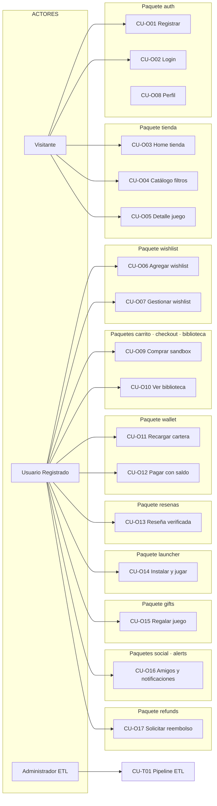
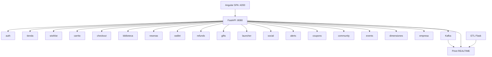

# Diagrama General de Casos de Uso — GameMetrics S.A.

Documento de referencia UML para entrega académica (estilo GA07).  
Complementa: `DOCUMENTO_CASOS_DE_USO_OPERATIVOS.md` (detalle por paquete).

---

## 1. Actores del sistema

| Actor | Descripción |
|-------|-------------|
| **Visitante** | Navega tienda sin autenticación |
| **Usuario Registrado** | Wishlist, carrito, biblioteca, wallet, social |
| **Comprador verificado** | Puede reseñar juegos adquiridos |
| **Administrador ETL** | Pipeline Parquet → Pinot, dimensiones |
| **Administrador** | CRUD colecciones empresariales |
| **Analista BI** | Dashboard KPIs (módulo archivado / Panel ETL) |
| **Partner B2B** | API keys, catálogo partner (community) |
| **Sistema (Kafka)** | Persistencia automática de eventos |

---

## 2. Diagrama general por paquetes (nivel operativo)



---

## 3. Diagrama textual (estilo GA07)

```
SISTEMA GAMEMETRICS S.A. — NIVEL OPERATIVO

── Paquete auth ──
Visitante ──────> CU-O01 Registrar usuario
Visitante ──────> CU-O02 Iniciar sesión (JWT 7 días)
Usuario ────────> CU-O08 Editar perfil y avatar

── Paquete tienda ──
Visitante ──────> CU-O03 Ver home (/store)
Visitante ──────> CU-O04 Ver catálogo con filtros (/store/catalog)
Visitante ──────> CU-O05 Ver detalle de juego (/store/game/:slug)

── Paquete wishlist ──
Usuario ────────> CU-O06 Agregar a wishlist
Usuario ────────> CU-O07 Ver y eliminar de wishlist

── Paquetes carrito · checkout · biblioteca ──
Usuario ────────> CU-O09 Agregar al carrito y pagar (sandbox)
Usuario ────────> CU-O10 Ver biblioteca de compras (/my-library)

── Paquete wallet ──
Usuario ────────> CU-O11 Recargar cartera (/my-wallet)
Usuario ────────> CU-O12 Pagar compra con saldo interno

── Paquete resenas ──
Comprador ──────> CU-O13 Escribir reseña verificada

── Paquete launcher ──
Comprador ──────> CU-O14 Instalar, jugar y desinstalar juego

── Paquete gifts ──
Usuario ────────> CU-O15 Regalar juego a otro usuario

── Paquete refunds ──
Comprador ──────> CU-O17 Solicitar reembolso (< 14 días)

── Paquetes social · alerts ──
Usuario ────────> CU-O16 Gestionar amigos y ver notificaciones

── Paquetes tácticos (administración) ──
Admin ETL ──────> CU-T01 Ejecutar pipeline ETL
Admin ETL ──────> CU-T02 Ver dimensiones (/dimensiones)
Administrador ──> CU-T03 CRUD empresa (/empresa)
```

---

## 4. Catálogo de casos de uso por paquete

### Nivel operativo — Paquetes de usuario final

| Paquete | Código | Caso de uso | Actor | Ruta UI |
|---------|--------|-------------|-------|---------|
| **auth** | CU-O01 | Registrar usuario | Visitante | `/store` → modal Registrarse |
| **auth** | CU-O02 | Iniciar sesión | Visitante | `/store` → modal Login |
| **auth** | CU-O08 | Editar perfil y avatar | Usuario | `/profile` |
| **tienda** | CU-O03 | Ver home tienda | Visitante | `/store` |
| **tienda** | CU-O04 | Filtrar catálogo | Visitante | `/store/catalog` |
| **tienda** | CU-O05 | Ver detalle juego | Visitante | `/store/game/:slug` |
| **wishlist** | CU-O06 | Agregar a wishlist | Usuario | Ficha juego → botón wishlist |
| **wishlist** | CU-O07 | Gestionar wishlist | Usuario | `/profile` |
| **carrito** | CU-O09a | Agregar al carrito | Usuario | Ficha → Añadir al carro |
| **checkout** | CU-O09b | Completar pago sandbox | Usuario | `/payment` |
| **biblioteca** | CU-O10 | Ver biblioteca | Usuario | `/my-library` |
| **wallet** | CU-O11 | Recargar cartera | Usuario | `/my-wallet` |
| **checkout** | CU-O12 | Pagar con cartera | Usuario | `/payment` |
| **resenas** | CU-O13 | Reseña verificada | Comprador | Ficha juego (poseído) |
| **launcher** | CU-O14 | Instalar y jugar | Comprador | `/my-library` |
| **gifts** | CU-O15 | Regalar juego | Usuario | Ficha → Regalar |
| **social** | CU-O16a | Gestionar amigos | Usuario | `/my-friends` |
| **alerts** | CU-O16b | Ver notificaciones | Usuario | Navbar → campana |
| **refunds** | CU-O17 | Solicitar reembolso | Comprador | `/my-library` → menú |

### Nivel táctico — Administración y datos

| Paquete | Código | Caso de uso | Actor | Ruta UI |
|---------|--------|-------------|-------|---------|
| **etl** | CU-T01 | Cargar semana Parquet → Pinot | Admin ETL | `/` Panel ETL |
| **dimensiones** | CU-T02 | Ver tablas dimensión | Admin ETL | `/dimensiones` |
| **empresa** | CU-T03 | CRUD colección empresarial | Administrador | `/empresa` |

### Nivel estratégico — BI (referencia)

| Paquete | Código | Caso de uso | Actor | Nota |
|---------|--------|-------------|-------|------|
| **dashboard** | CU-E01 | Consultar KPIs por semana | Analista BI | Router en `_archivado`; Panel ETL en `/` |

---

## 5. Los 10 casos de uso para el video

| # | Paquete | Caso de uso | Navegación desde inicio |
|---|---------|-------------|-------------------------|
| 1 | etl | CU-T01 Cargar semana 1 | `localhost:4200/` → Panel ETL |
| 2 | tienda | CU-O03 Home tienda | `/store` |
| 3 | tienda | CU-O04 Filtrar catálogo | `/store` → CATÁLOGO |
| 4 | auth | CU-O01 Registrarse | `/store` → Iniciar sesión → Registrarse |
| 5 | wishlist | CU-O06 Agregar wishlist | Login → ficha → Wishlist |
| 6 | carrito+checkout+biblioteca | CU-O09 Compra sandbox | Ficha → Carro → `/payment` → `/my-library` |
| 7 | wallet | CU-O12 Pagar con cartera | `/my-wallet` → recargar → pagar |
| 8 | resenas | CU-O13 Reseña verificada | Biblioteca → ficha → reseña |
| 9 | launcher | CU-O14 Instalar y jugar | `/my-library` → Instalar → Jugar |
| 10 | gifts | CU-O15 Regalar juego | Ficha → Regalar → `/my-gifts` aceptar |

---

## 6. Relación paquete → tablas Pinot (resumen)

| Paquete | Tablas principales |
|---------|-------------------|
| auth | `fact_users` |
| tienda | `fact_videogames`, `dim_*`, `fact_game_products` |
| wishlist | `fact_wishlist` |
| carrito | `fact_cart` |
| checkout | `fact_orders`, `fact_order_items`, `fact_payments`, `fact_purchases` |
| biblioteca | `fact_purchases` (lectura) |
| wallet | `fact_user_wallets`, `fact_wallet_transactions` |
| resenas | `fact_reviews` |
| refunds | `fact_refunds` |
| gifts | `fact_gifts` |
| launcher | `fact_install_states`, `fact_play_sessions`, `fact_builds` |
| social | `fact_friendships`, `fact_notifications` |
| alerts | `fact_wishlist_price_alerts`, `fact_notifications` |
| empresa | `emp_records` |
| dimensiones | `dim_*` (lectura OFFLINE) |

---

## 7. Diagrama de paquetes backend (componentes)



Ver detalle de cada paquete en `DOCUMENTO_CASOS_DE_USO_OPERATIVOS.md`.
