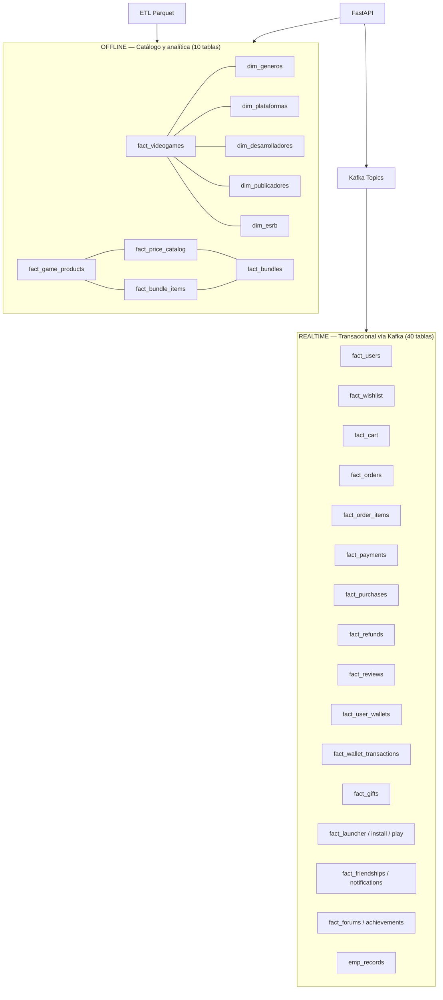
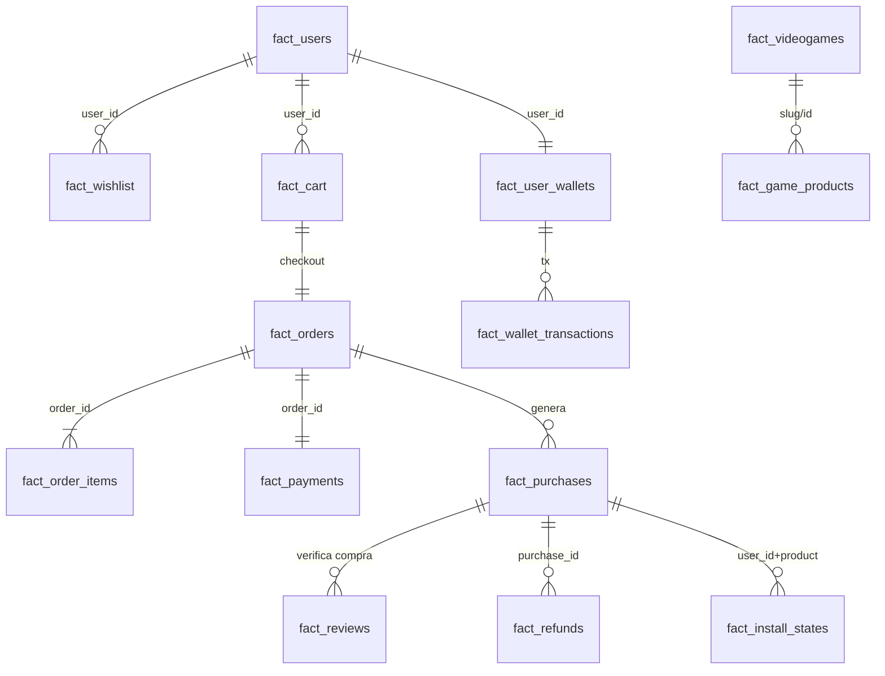

# Diseño de la Base de Datos — GameMetrics S.A.

**Motor:** Apache Pinot 1.0.0 (única base de datos del sistema)  
**Streaming:** Apache Kafka 7.7.2 (escrituras transaccionales)  
**Total de tablas:** 50 (10 OFFLINE + 40 REALTIME)

> Referencia técnica: `specs/004-plataforma-pinot-steam/spec.md` · Schemas: `etl/pinot_schemas/`

---

## 1. Principios de diseño

| # | Principio | Descripción |
|---|-----------|-------------|
| P1 | Orientado a eventos | Toda escritura transaccional → Kafka → Pinot REALTIME |
| P2 | Upsert + soft delete | PK por tabla; borrado lógico `deleted = TRUE` (tombstone) |
| P3 | Sin SQL relacional | No PostgreSQL/MySQL/MongoDB/Redis |
| P4 | OFFLINE inmutable | Catálogo analítico cargado por ETL semanal (Parquet) |
| P5 | Integridad en app | Relaciones lógicas en FastAPI, no FK en Pinot |

---

## 2. Vista general del modelo



---

## 3. Tablas OFFLINE (10)

Cargadas vía ETL (`04_ingest_pinot.py`, `07_create_dimensions.py`, `10_create_catalog_tables.py`).

| # | Tabla | PK | Dominio | Script ETL |
|---|-------|-----|---------|------------|
| 01 | `fact_videogames` | `id` | Catálogo ~1.7M juegos | `04_ingest_pinot.py` |
| 02 | `dim_generos` | `dim_id` | Dimensión géneros | `07_create_dimensions.py` |
| 03 | `dim_plataformas` | `dim_id` | Dimensión plataformas | `07_create_dimensions.py` |
| 04 | `dim_desarrolladores` | `dim_id` | Dimensión desarrolladores | `07_create_dimensions.py` |
| 05 | `dim_publicadores` | `dim_id` | Dimensión publicadores | `07_create_dimensions.py` |
| 06 | `dim_esrb` | `dim_id` | Clasificación ESRB | `07_create_dimensions.py` |
| 07 | `fact_game_products` | `product_id` | Producto vendible (base/DLC) | `10_create_catalog_tables.py` |
| 08 | `fact_bundles` | `bundle_id` | Paquetes promocionales | `10_create_catalog_tables.py` |
| 09 | `fact_bundle_items` | `bundle_item_id` | Items del bundle | `10_create_catalog_tables.py` |
| 10 | `fact_price_catalog` | `price_id` | Precio por región/moneda | `10_create_catalog_tables.py` |

**Filtro analítico:** `WHERE semana <= N` (semanas 1–17 acumuladas).

---

## 4. Tablas REALTIME (40)

Creadas por `etl/08_create_realtime_tables.py`. Topic Kafka = nombre de tabla.

### 4.1 Identidad y wallet (4)

| # | Tabla | PK | Paquete backend |
|---|-------|-----|-----------------|
| 11 | `fact_users` | `user_id` | `auth` |
| 12 | `fact_user_sessions` | `session_id` | `auth` (roadmap) |
| 13 | `fact_user_wallets` | `user_id` | `wallet` |
| 14 | `fact_wallet_transactions` | `tx_id` | `wallet` |

### 4.2 Comercio (10)

| # | Tabla | PK | Paquete backend |
|---|-------|-----|-----------------|
| 15 | `fact_cart` | `cart_item_id` | `carrito` |
| 16 | `fact_orders` | `order_id` | `checkout` |
| 17 | `fact_order_items` | `order_item_id` | `checkout` |
| 18 | `fact_payments` | `payment_id` | `checkout` |
| 19 | `fact_purchases` | `purchase_id` | `biblioteca`, `checkout` |
| 20 | `fact_refunds` | `refund_id` | `refunds` |
| 21 | `fact_gifts` | `gift_id` | `gifts` |
| 22 | `fact_coupons` | `coupon_code` | `coupons` |
| 23 | `fact_coupon_redemptions` | `redemption_id` | `coupons` |
| 24 | `fact_promotions` | `promo_id` | `coupons` / ETL seed |

### 4.3 Engagement (5)

| # | Tabla | PK | Paquete backend |
|---|-------|-----|-----------------|
| 25 | `fact_wishlist` | `wishlist_id` | `wishlist` |
| 26 | `fact_wishlist_price_alerts` | `alert_id` | `alerts` |
| 27 | `fact_reviews` | `review_id` | `resenas` |
| 28 | `fact_review_votes` | `vote_id` | `resenas` (roadmap) |
| 29 | `fact_user_events` | `event_id` | `events` |

### 4.4 Social (3)

| # | Tabla | PK | Paquete backend |
|---|-------|-----|-----------------|
| 30 | `fact_friendships` | `friendship_id` | `social` |
| 31 | `fact_user_activity` | `activity_id` | `social` |
| 32 | `fact_notifications` | `notification_id` | `social`, `alerts` |

### 4.5 Distribución digital (4)

| # | Tabla | PK | Paquete backend |
|---|-------|-----|-----------------|
| 33 | `fact_builds` | `build_id` | `launcher` |
| 34 | `fact_download_tokens` | `token_id` | `launcher` |
| 35 | `fact_install_states` | `install_id` | `launcher` |
| 36 | `fact_play_sessions` | `session_id` | `launcher` |

### 4.6 Publisher / B2B (4)

| # | Tabla | PK | Paquete backend |
|---|-------|-----|-----------------|
| 37 | `emp_records` | `record_id` | `empresa` |
| 38 | `fact_partner_accounts` | `partner_id` | `community` |
| 39 | `fact_partner_games` | `partner_game_id` | `community` |
| 40 | `fact_revenue_snapshots` | `snapshot_id` | `community` |

### 4.7 Soporte y moderación (2)

| # | Tabla | PK | Paquete backend |
|---|-------|-----|-----------------|
| 41 | `fact_support_tickets` | `ticket_id` | `social` |
| 42 | `fact_user_sanctions` | `sanction_id` | `community` |

### 4.8 Comunidad extendida (4)

| # | Tabla | PK | Paquete backend |
|---|-------|-----|-----------------|
| 43 | `fact_achievements` | `achievement_id` | `launcher` |
| 44 | `fact_user_achievements` | `user_achievement_id` | `launcher` |
| 45 | `fact_forum_threads` | `thread_id` | `community` |
| 46 | `fact_forum_posts` | `post_id` | `community` |

### 4.9 Family sharing (2)

| # | Tabla | PK | Paquete backend |
|---|-------|-----|-----------------|
| 47 | `fact_family_groups` | `group_id` | `community` |
| 48 | `fact_family_shares` | `share_id` | `community` |

### 4.10 API y analytics (2)

| # | Tabla | PK | Paquete backend |
|---|-------|-----|-----------------|
| 49 | `fact_api_keys` | `key_id` | `community` |
| 50 | `fact_search_queries` | `query_id` | `community` |

---

## 5. Matriz de implementación

Leyenda:

| Símbolo | Significado |
|---------|-------------|
| ✅ | Operativo en demo (ETL + backend + UI o API activa) |
| 🟡 | Tabla creada en Pinot; backend parcial o sin UI |
| 📋 | Schema + ETL listos; integración backend en roadmap |

| Tabla | Schema | ETL Pinot | Backend | Demo UI |
|-------|--------|-----------|---------|---------|
| fact_videogames | ✅ | ✅ | ✅ tienda | ✅ |
| dim_* (5) | ✅ | ✅ | ✅ dimensiones | ✅ |
| fact_game_products | ✅ | ✅ | 🟡 | 🟡 |
| fact_bundles / items / price_catalog | ✅ | ✅ | 📋 | 📋 |
| fact_users | ✅ | ✅ | ✅ auth | ✅ |
| fact_wishlist | ✅ | ✅ | ✅ wishlist | ✅ |
| fact_cart | ✅ | ✅ | ✅ carrito | ✅ |
| fact_orders / order_items / payments | ✅ | ✅ | ✅ checkout | ✅ |
| fact_purchases | ✅ | ✅ | ✅ biblioteca | ✅ |
| fact_refunds | ✅ | ✅ | ✅ refunds | ✅ |
| fact_reviews | ✅ | ✅ | ✅ resenas | ✅ |
| fact_user_wallets / wallet_transactions | ✅ | ✅ | ✅ wallet | ✅ |
| fact_gifts | ✅ | ✅ | ✅ gifts | ✅ |
| fact_coupons / redemptions / promotions | ✅ | ✅ | 🟡 coupons | 🟡 |
| fact_install_states / play_sessions / builds | ✅ | ✅ | ✅ launcher | ✅ |
| fact_achievements / user_achievements | ✅ | ✅ | ✅ launcher | ✅ |
| fact_friendships / notifications | ✅ | ✅ | ✅ social | ✅ |
| fact_wishlist_price_alerts | ✅ | ✅ | ✅ alerts | ✅ |
| fact_user_events | ✅ | ✅ | 🟡 events | 📋 |
| emp_records | ✅ | ✅ | ✅ empresa | ✅ |
| fact_forum_* / family_* / partner_* / api_keys / search_queries | ✅ | ✅ | 🟡 community | 🟡 |
| fact_support_tickets / user_sanctions | ✅ | ✅ | 🟡 social/community | 🟡 |
| fact_user_sessions / review_votes | ✅ | ✅ | 📋 | 📋 |
| fact_download_tokens | ✅ | ✅ | 🟡 launcher | 📋 |

**Resumen:** 50 tablas con schema y ETL; **~25 con flujo demo completo**; el resto documentado para fases posteriores.

---

## 6. Relaciones lógicas (sin FK en Pinot)



---

## 7. Flujo de escritura transaccional

```
Usuario → Angular → FastAPI → kafka_send(topic, pk, payload)
                                    ↓
                              Apache Kafka
                                    ↓
                              Pinot REALTIME (upsert ≤ 2 s)
```

Ejemplo registro:

```python
await kafka_send("fact_users", user_id, {
    "user_id": user_id,
    "email": email,
    "password_hash": hashed,
    "deleted": False,
})
```

---

## 8. Verificación en Pinot (para video/demo)

1. Ejecutar `.\inicio.ps1` o Panel ETL → **Tablas REALTIME**.
2. Abrir http://localhost:9000 → **Tables**.
3. Confirmar 50 tablas (OFFLINE + REALTIME) listadas.

---

## 9. Evolución documentada

| Fase | Alcance | Estado |
|------|---------|--------|
| Fase 0 | Modelo estrella + 3 REALTIME base | ✅ |
| Fase 1 | Comercio (carrito, orders, purchases) | ✅ |
| Fase 2 | Wallet, gifts, coupons | ✅ |
| Fase 3 | Launcher, installs, achievements | ✅ |
| Fase 4 | Social, partners, support | 🟡 |
| Fase 5 | Foros, family sharing, API keys | 🟡 |

Actualizar esta matriz al conectar nuevos routers en `backend/main.py`.
