# Flujos del sistema (Mermaid)

Diagramas alineados al código actual de GameMetrics.

## Registro desarrollador / partner

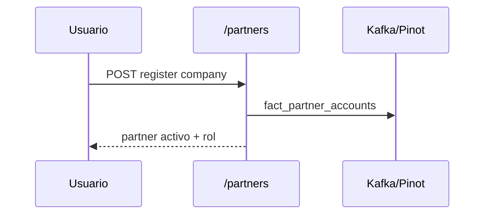

## Publicación / claim

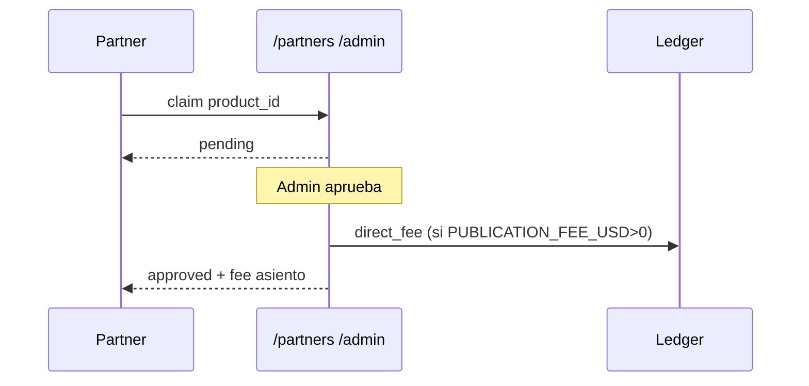

## Compra + revenue share

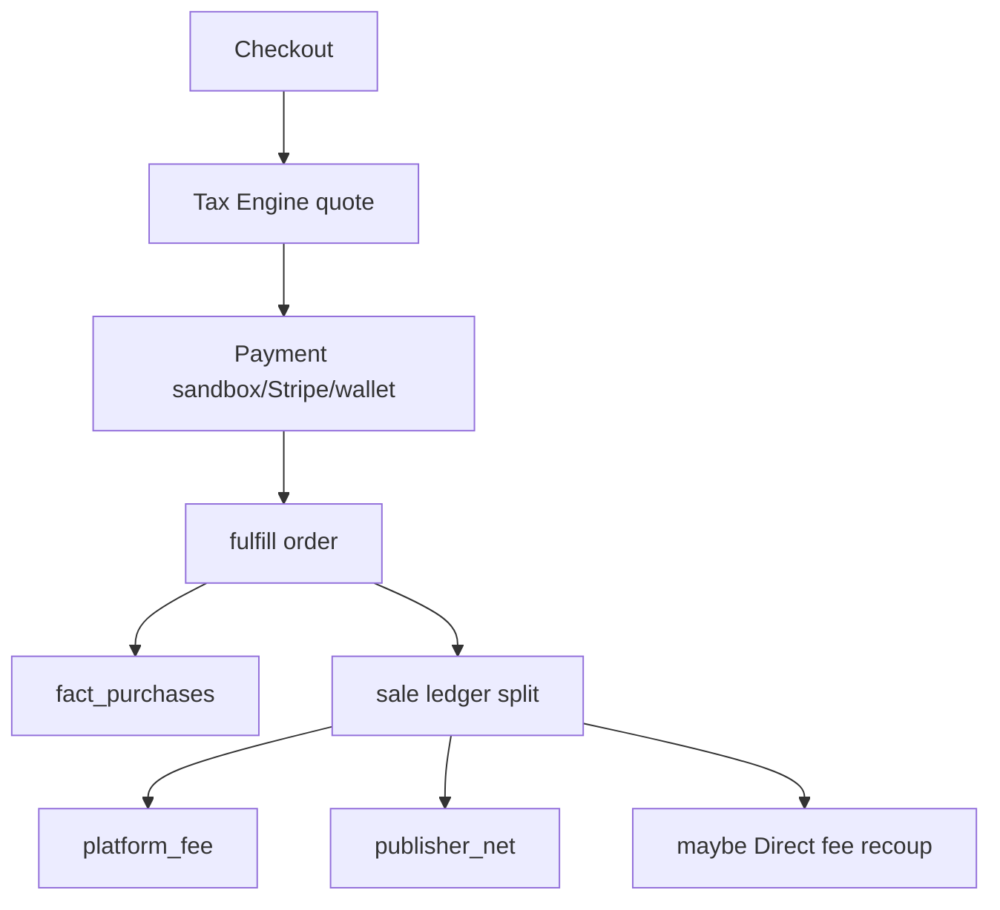

## Pago

```mermaid
flowchart LR
  Cart --> IdempotencyKey
  IdempotencyKey --> Provider{wallet|stripe|sandbox}
  Provider --> PaymentRecord
  PaymentRecord --> Fulfill
```

## Refund

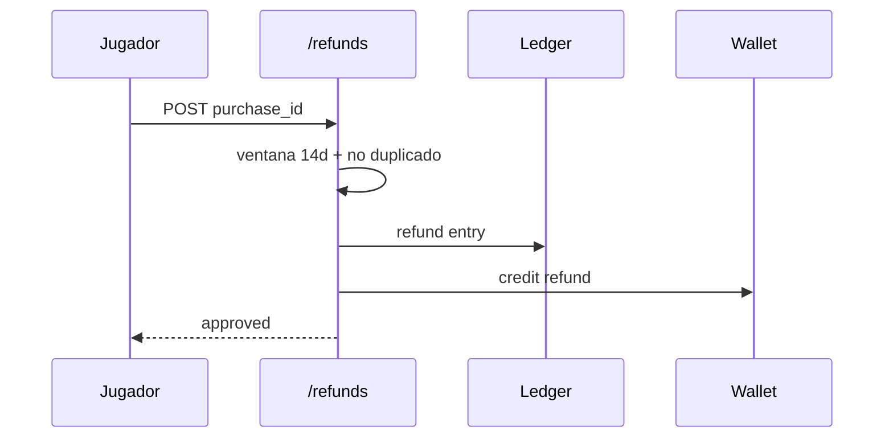

## Chargeback

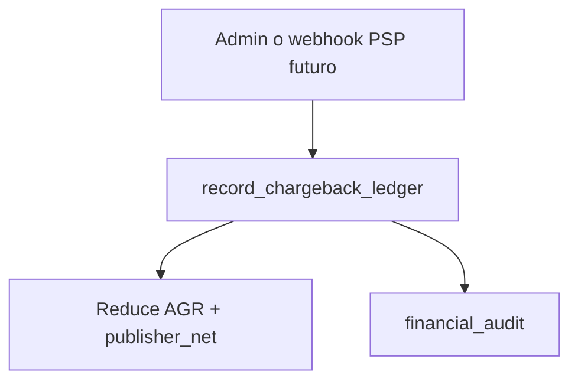

## Payout

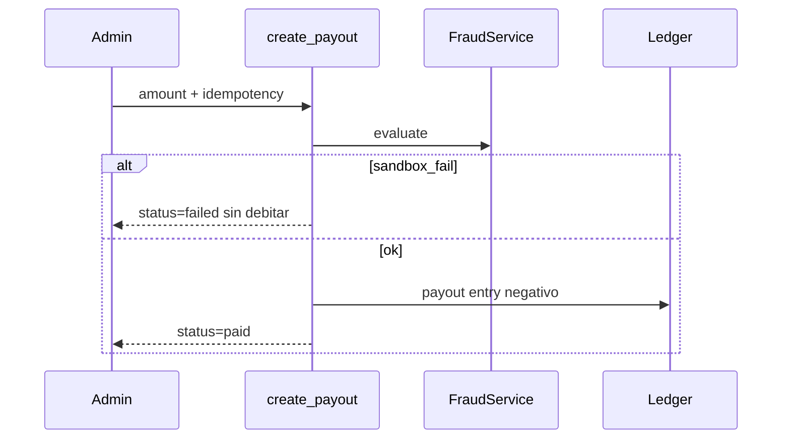

## Wallet

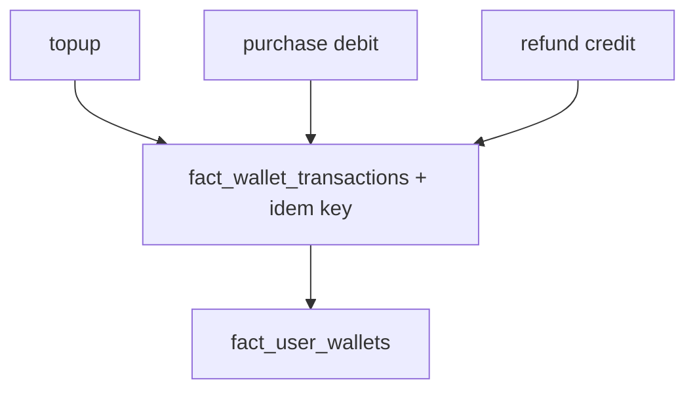

## Marketplace

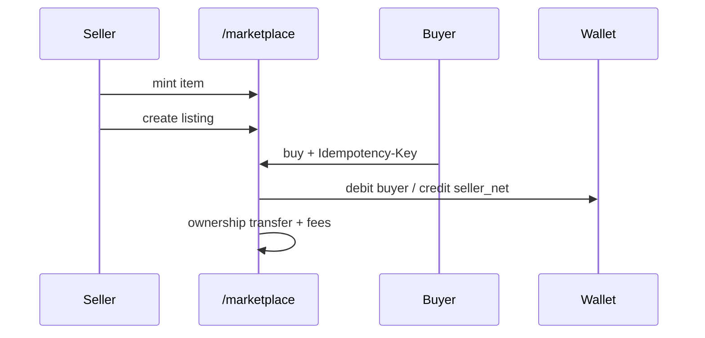

## Impuestos

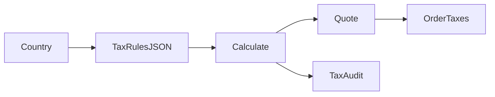

## Promoción / Featured

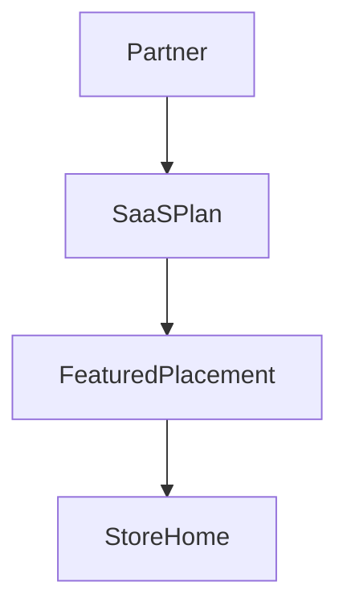

## Fraud detection

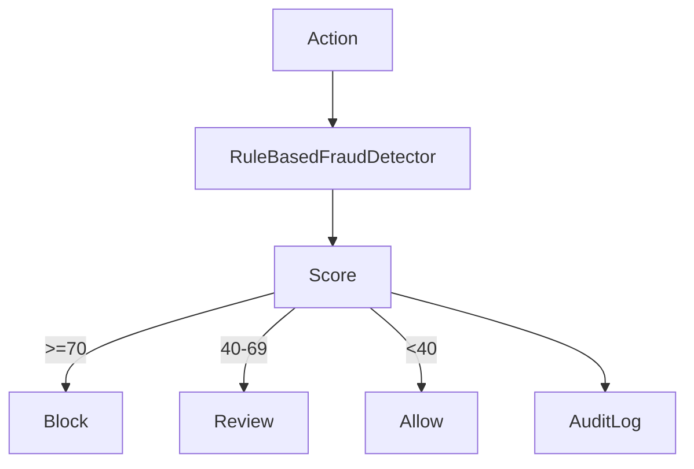

## Auditoría financiera

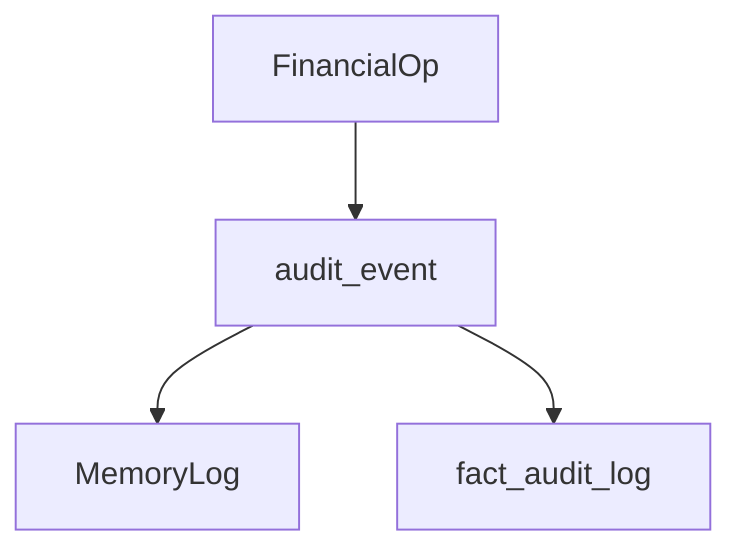

## Compra in-game (diseño / futuro DLC)

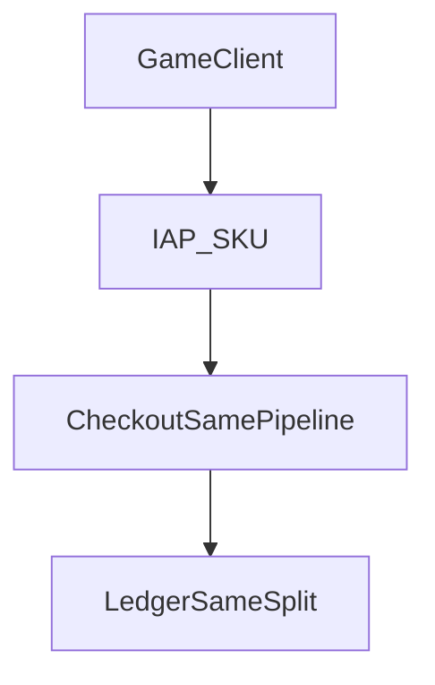
